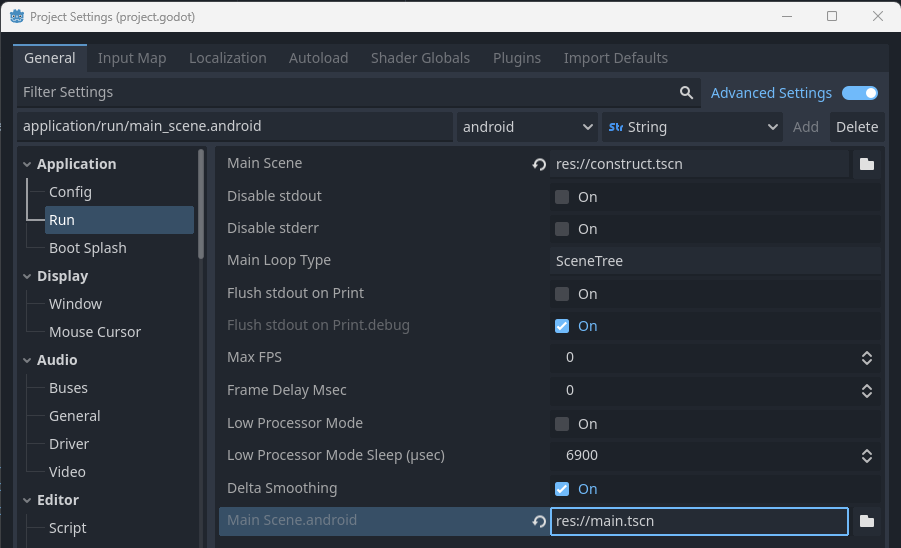
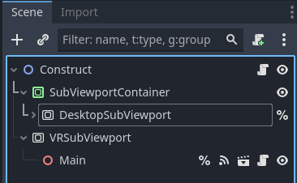
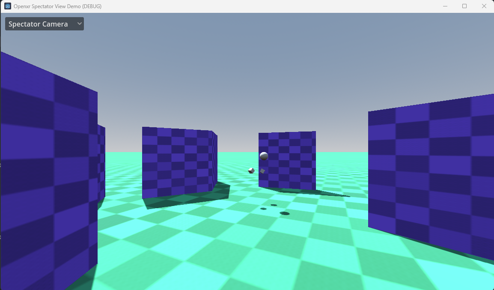

# XR spectator view demo

This is a demo for an OpenXR project where the player sees a different view inside of the headset
compared to what a spectator sees on screen.
When deployed to a standalone XR device, only the player environment is exported.

Language: GDScript

Renderer: Compatibility

Check out this demo on the asset library: https://godotengine.org/asset-library/asset/????

## How does it work?

The VR game itself is contained within the `main.tscn` scene. This is similar to the other XR demos found on this repo.
This demo has a bare bones example as to not distract from the solution we're presenting here.

When run on standalone VR headsets, that scene is loaded.

When run on desktop, we load the `construct.tscn` scene instead. This scene has the `main.tscn` scene as a child of a
`SubViewport` which will be used to output the render result to the headset.

The construct scene also contains a `SubviewportContainer` with a `SubViewport` that renders the output that the user
sees on the desktop screen.
By default this will show a 3rd person camera that shows our player.

We've also configured our visual layers as follows:
1. Layer 1 is visible both inside of the headset and by the 3rd person camera.
2. Layer 2 is only visible inside of the headset.
3. Layer 3 is only visible in the 3rd person camera.
This is used to render the "head" of the player in spectator view only.

Finally, a dropdown also allows us to switch to showing either the left eye or right eye result the player is seeing.

## Tracked camera

There is also an option in the demo to enable camera tracking.
This is currently only supported on SteamVR together with a properly configured HTC Vive Tracker.

When properly setup, this allows you to use a Vive tracker to position the 3rd person camera.
Attaching the Vive tracker to a physical camera, and setting the correct offset would allow
implementation of mixed reality capture by combining the 3rd person render result,
with a green screened captured camera.

## Action map

This project does not use the default action map but instead configures an action map that just contains the actions required for this example to work. This so we remove any clutter and just focus on the functionality being demonstrated.

There is only one action needed for this example:
- hand_pose is used to position the XR controllers

Also following OpenXR guidelines only bindings for controllers with which the project has been tested are supplied. XR Runtimes should provide proper re-mapping however not all follow this guideline. You may need to add a binding for the platform you are using to the action map.

## Running on PCVR

This project is specifically designed for PCVR. Ensure that an OpenXR runtime has been installed.
This project has been tested with the Oculus client and SteamVR OpenXR runtimes.
Note that Godot currently can't run using the WMR OpenXR runtime. Install SteamVR with WMR support.

## Running on standalone VR

This project also shows how deploying to standalone skips the spectator view option.
You must install the Android build templates and [OpenXR vendors plugin](https://github.com/GodotVR/godot_openxr_vendors/releases) and configure an export template for your device.
Please follow [the instructions for deploying on Android in the manual](https://docs.godotengine.org/en/stable/tutorials/xr/deploying_to_android.html).

## Screenshots

